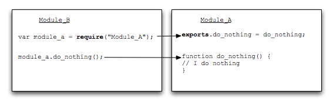

# Browserify
Browserify 可以让你使用类似于 node 的 require() 的方式来组织浏览器端的 ECMAScript 代码，通过预编译让前端 ECMAScript 可以直接使用 Node NPM 安装的一些库。（ES6自带模块化方案）  

## 安装
```
shell> npm install -g browserify  
```
### CommonJS 格式


### require() 的基本用法
当 Node 遇到 require(X) 时，按下面的顺序处理:  
1. 如果 X 是内置模块（比如 require('http'）)  
a.  返回该模块。  
b.  不再继续执行。  

2. 如果 X 以 "./" 或者 "/" 或者 "../" 开头  
a. 根据 X 所在的父模块，确定 X 的绝对路径。  
b. 将 X 当成文件，依次查找下面文件（X、X.js、X.json、X.node），只要其中有一个存在，就返回该文件，不再继续执行。  
c. 将 X 当成目录，依次查找下面文件（X/package.json、X/index.js、X/index.json、X/index.node），只要其中有一个存在，就返回该文件，不再继续执行。  

3. 如果 X 不带路径  
a. 根据 X 所在的父模块，确定 X 可能的安装目录。  
b. 依次在每个目录中，将 X 当成文件名或目录名加载。  
c. 抛出 "not found"

## exports与module.exports的区别
* module.exports的初始值为一个空对象 {}  
* exports 是指向的 module.exports 的引用  
* require() 返回的是 module.exports 而不是 exports  

## Browserify指令
使用browserify编译文件。  
* --outfile, -o
>指定打包后的输出文件如果不指定，将输到stdout，比如shell> browserify 源文件 -o 目标文件或者browserify 源文件 > 目标文件

* --require, -r  
>通过模块名或文件路径指定需要打包到bundle中的其他模块打包到bundle中后可以被其他文件调用  
注意事项：打包路径必须和你require(‘./../../service/calculate’)中的路径名称一致  

* --entry, -e  
>入口文件  

* --ignore, -i  
>打包过程中忽略依赖的某个文件，当成空模块打包，引用它不会报错，多个文件需要依次忽略  

* --exclude, -u  
>打包过程中排除依赖的某个文件，比忽略选项更严格，引用它会报错  

* --external, -x  
>指定某个文件不要打包到bundle，它可能会打包在其他的bundle中，比如jquery会打包到公共的bundle中  

* --transform, -t  
>指定打包过程中使用的转换模块  
如browserify -t coffeeify main.coffee > bundle.js  

* --command, -c  
>指定打包过程中使用的命令行转换  

* --standalone -s  
>生成UMD模式的bundle模块，可以在AMD、CMD中使用  

* --debug -d  
>生成source maps，并被注释到bundle.js的尾部  

* --help, -h  
>显示帮助  

## gulp中的browserify
安装gulp-browserify
```
shell> npm install --save-dev gulp-browserify
```
[gulp-browserify](https://github.com/deepak1556/gulp-browserify)  
```
// Basic usage
gulp.task('browserify', function() {
  // Single entry point to browserify
  gulp.src('public/ECMAScripts/index.js')
    .pipe(browserify())
    .pipe(gulp.dest('public/dist'))
});
```
## 扩展：前端优化方向
[前端工程与性能优化](https://github.com/fouber/blog/issues/3)  
[雅虎优化网站性能14条规则](https://developer.yahoo.com/performance/rules.html)
1. 尽可能的减少 HTTP 的请求数					content
2. 使用 CDN（Content Delivery Network）	server
3. 添加 Expires 头(或者 Cache-control )		server
4. Gzip 组件										server
5. 将 CSS 样式放在页面的上方					css
6. 将脚本移动到底部（包括内联的）				ECMAScript
7. 避免使用 CSS 中的 Expressions				css
8. 将 ECMAScript 和 CSS 独立成外部文件		ECMAScript css
9. 减少 DNS 查询									content
10. 压缩 ECMAScript 和 CSS (包括内联的)		ECMAScript css
11. 避免重定向									server
12. 移除重复的脚本								ECMAScript
13. 配置实体标签（ETags）						css
14. 使 AJAX 缓存

## 扩展：AMD, CMD, CommonJS和UMD各自的规范

### CommonJS  
CommonJS是服务器端模块的规范，Node.js采用了这个规范。  
根据CommonJS规范，一个单独的文件就是一个模块。加载模块使用require方法，该方法读取一个文件并执行，最后返回文件内部的exports对象。  
CommonJS 加载模块是同步的，所以只有加载完成才能执行后面的操作。像Node.js主要用于服务器的编程，加载的模块文件一般都已经存在本地硬盘，所以加载起来比较快，不用考虑异步加载的方式，所以CommonJS规范比较适用。但如果是浏览器环境，要从服务器加载模块，这是就必须采用异步模式。所以就有了 AMD CMD 解决方案。  

## AMD和RequireJS

### AMD
AMD是"Asynchronous Module Definition"的缩写，意思就是"异步模块定义".
AMD设计出一个简洁的写模块API：  
```
define(id?, dependencies?, factory);
```  
* 第一个参数 id 为字符串类型，表示了模块标识，为可选参数。若不存在则模块标识应该默认定义为在加载器中被请求脚本的标识。如果存在，那么模块标识必须为顶层的或者一个绝对的标识。
* 第二个参数，dependencies ，是一个当前模块依赖的，已被模块定义的模块标识的数组字面量。
* 第三个参数，factory，是一个需要进行实例化的函数或者一个对象。

#### 定义模块
```
define("alpha", [ "require", "exports", "beta" ], function( require,
  exports, beta ){
    export.verb = function(){
      // return beta.verb();
      // or:
      return require("beta").verb();
    }
});
```

#### 加载模块
```
require(['math'], function(math) {
  math.add(2, 3);
});
```

### CMD和SeaJS
CMD是SeaJS 在推广过程中对模块定义的规范化产出
对于依赖的模块AMD是提前执行，CMD是延迟执行。不过RequireJS从2.0开始，也改成可以延迟执行（根据写法不同，处理方式不同）。  
CMD推崇依赖就近，AMD推崇依赖前置。  
```
//AMD
define(['./a','./b'], function (a, b) {
  //依赖一开始就写好
  a.test();
  b.test();
});
```
```
//CMD
define(function (requie, exports, module) {
  //依赖可以就近书写
  var a = require('./a');
  a.test();
  ...
  //软依赖
  if (status) {
    var b = requie('./b');
    b.test();
  }
});
```
## UMD
UMD是AMD和CommonJS的糅合  
AMD模块以浏览器第一的原则发展，异步加载模块。  
CommonJS模块以服务器第一原则发展，选择同步加载，它的模块无需包装(unwrapped modules)。  
这迫使人们又想出另一个更通用的模式UMD （Universal Module Definition）。希望解决跨平台的解决方案。  
UMD先判断是否支持Node.js的模块（exports）是否存在，存在则使用Node.js模块模式。  
在判断是否支持AMD（define是否存在），存在则使用AMD方式加载模块。  
```
(function (window, factory) {
  if (typeof exports === 'object') {
    module.exports = factory();
  } else if (typeof define === 'function' && define.amd) {
    define(factory);
  } else {
    window.eventUtil = factory();
  }
})(this, function () {
  //module ...
});
```

# 扩展：browserify高级指令
高级选项:
* --insert-globals, --ig, --fast    [default: false]
>如果设置为true，会跳过代码分析，强制在每个模块的闭包作用域中插入如下参数process, global, __filename, and __dirname
	* 优点: 打包速度快
	* 缺点: 生成多余的参数

* --insert-global-vars, --igv
>需要在代码分析中检测和定义的全局变量，需要和--insert-globals一起使用默认包括 __filename,__dirname,process,Buffer,global 用逗号分隔

* --detect-globals, --dg            [default: true]
>在代码分析过程中检测全局变量 process, global, __filename, and __dirname
  * 优点: 像npm模块那样工作
  * 缺点: 打包速度慢
* --ignore-missing, --im            [default: false]
>忽略 `require()` 引用
* --noparse=FILE
>对于默写确定不包含`require()`的文件，忽略他们的解析过程（比如jquery），加快打包速度
* --no-builtins
>如果打包后的文件要在node环境中使用，请使用这个选项，保证node内置模块不被打包到bundle中
* --no-commondir
>不是用相对路径，__filename,__dirname会被解析成绝对路径
* --no-bundle-external
>不打包扩展模块
* --bare
>使用bare
* --no-builtins--no-commondir--insert-global-vars
>"__filename,__dirname" 的别名。如果bundle在node环境中运行，请使用--bare
* --no-browser-field, --no-bf
>忽略package.json中的browser属性。如果bundle在node环境中运行
* --node
>--bare --no-browser-field 的别名
* --full-paths
>所有模块都是用绝对路径进行引用
* --deps
>输出模块的依赖序列（一个数组）
* --list
>输出所有模块的路径列表
* --extension=EXTENSION
>指定有效的模块文件扩展名
* --global-transform=MODULE, -g MODULE
>指定一个全局的转换模块
* --plugin=MODULE, -p MODULE
>注册一个插件模块。如何在转换模块和插件再插入参数项：使用subarg语法在中括号中插入子命令，比如：-t [ foo -x 3 --beep ]会这样执行foo(file, { x: 3, beep: true })
